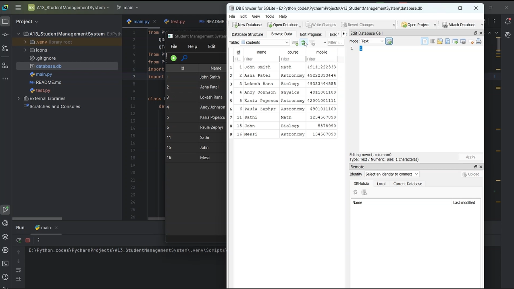
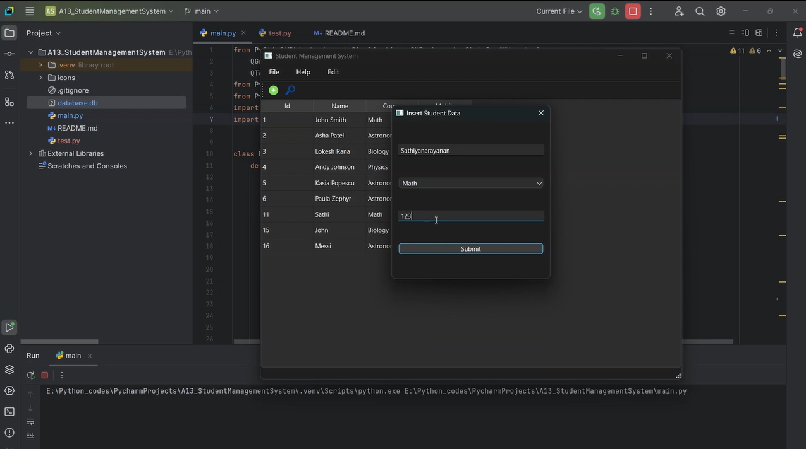

# 🎓 Student Management System

A **PyQt6**-based desktop application for managing student records. This system allows you to add, edit, delete, and search student data efficiently. It uses **SQLite** for database management, making it lightweight and easy to use.

---

## 🛠️ Features

- **Add Students**: Easily add new student records with name, course, and mobile number.
- **Edit Records**: Update existing student information.
- **Delete Records**: Remove student entries from the database.
- **Search Functionality**: Quickly find students by name.
- **User-Friendly Interface**: Built with PyQt6 for a smooth and intuitive experience.

---

## 🚦 How to Use

1. Install the required dependencies (`PyQt6` and `sqlite3`).
2. Run the application using the provided script.
3. Use the menu options or toolbar buttons to add, edit, delete, or search for student records.

---

## 📸 Screenshots

---

## 🎥 Demo

---

## 📬 Contact

Feel free to explore the project and share your feedback. For any inquiries, suggestions, or contributions, reach out to me at **sathiyanarayanan.s1698@gmail.com**.
